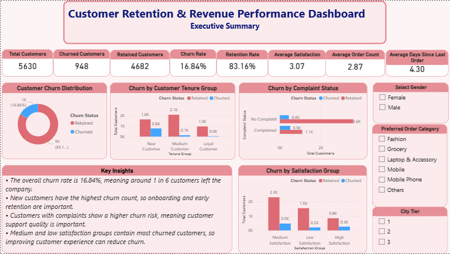
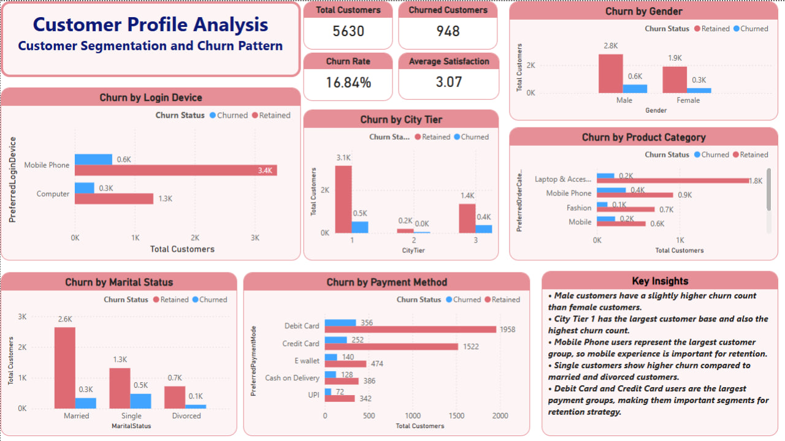
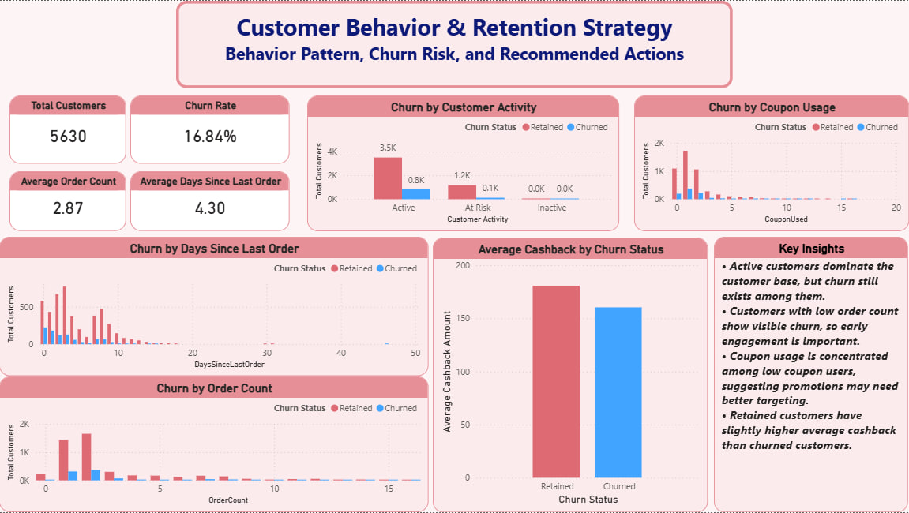

# Customer Retention & Revenue Performance Analysis Dashboard

## Project Overview

This project analyzes customer churn and retention behavior using an e-commerce customer dataset. The goal is to understand why customers leave, which customer groups have higher churn risk, and what actions the business can take to improve customer retention.

The project was built using **Power BI**, with data cleaning in **Power Query** and KPI calculations using **DAX**.

---

## Business Problem

Customer churn is an important business problem because losing customers can reduce revenue and increase marketing costs. This dashboard helps answer key business questions:

* How many customers churned and how many were retained?
* Which customer profiles have higher churn risk?
* What customer behaviors are related to churn?
* What actions can the company take to improve retention?

---

## Dataset

The dataset used in this project is an e-commerce customer churn dataset.

Main columns include:

* `CustomerID` - unique customer ID
* `Churn` - whether the customer left or stayed
* `Tenure` - how long the customer stayed with the company
* `PreferredLoginDevice` - customer’s preferred login device
* `CityTier` - customer city level
* `PreferredPaymentMode` - preferred payment method
* `Gender` - customer gender
* `OrderCount` - number of orders
* `CouponUsed` - number of coupons used
* `SatisfactionScore` - customer satisfaction level
* `Complain` - whether the customer complained
* `DaySinceLastOrder` - days since the last order
* `CashbackAmount` - cashback received by customer

---

## Tools Used

* **Power BI** - dashboard creation and data visualization
* **Power Query** - data cleaning and transformation
* **DAX** - calculated columns and measures
* **Excel** - dataset source

---

## Data Cleaning and Transformation

Main cleaning steps:

* Loaded the `E Comm` sheet from the Excel dataset
* Changed correct data types for numeric and text columns
* Replaced missing values in important numeric columns
* Standardized text values such as payment method and login device
* Renamed columns to make them easier to understand
* Created new calculated columns for analysis

Created calculated columns:

* `Churn Status`
* `Complaint Status`
* `Customer Activity`
* `Tenure Group`
* `Satisfaction Group`

Created DAX measures:

* `Total Customers`
* `Churned Customers`
* `Retained Customers`
* `Churn Rate`
* `Retention Rate`
* `Average Satisfaction`
* `Average Order Count`
* `Average Days Since Last Order`
* `Average Cashback Amount`

---

## Dashboard Pages

### 1. Executive Summary

This page gives an overall view of customer retention performance.

Main visuals:

* Total Customers
* Churned Customers
* Retained Customers
* Churn Rate
* Retention Rate
* Customer Churn Distribution
* Churn by Tenure Group
* Churn by Complaint Status
* Churn by Satisfaction Group



---

### 2. Customer Profile Analysis

This page analyzes customer segments and churn patterns.

Main visuals:

* Churn by Gender
* Churn by City Tier
* Churn by Login Device
* Churn by Product Category
* Churn by Marital Status
* Churn by Payment Method



---

### 3. Customer Behavior & Retention Strategy

This page analyzes customer behavior before churn and provides retention insights.

Main visuals:

* Churn by Customer Activity
* Churn by Coupon Usage
* Churn by Days Since Last Order
* Churn by Order Count
* Average Cashback by Churn Status



---

## Key Insights

* The overall churn rate is **16.84%**, meaning around 1 in 6 customers left the company.
* New customers have the highest churn count, so onboarding and early retention are important.
* Customers with complaints show higher churn risk, meaning customer support quality is important.
* City Tier 1 has the largest customer base and the highest churn count.
* Mobile Phone users represent the largest customer group, so mobile experience is important for retention.
* Customers with low order count show visible churn, so early engagement is important.
* Retained customers have slightly higher average cashback than churned customers.

---

## Business Recommendations

* Improve onboarding support for new customers.
* Follow up quickly with customers who submit complaints.
* Target low-activity customers before they become inactive.
* Provide product recommendations or offers to customers with low order count.
* Improve mobile app experience because most customers use mobile devices.
* Prioritize retention campaigns for high-value and high-risk customer segments.

---

## Project Files

```text
Business_analyst/
│
├── bi/
│   └── Customer_Retention_Dashboard.pbix
│
├── data/
│   └── E Commerce Dataset.xlsx
│
├── images/
│   ├── ExecutiveSummary.jpg
│   ├── Customer_Profile_Analysis.jpg
│   ├── Customer_BehaviorNRetention_Strategy.jpg
│   └── KeyMeaning.jpg
│
├── report/
│
└── README.md
```

---

## Conclusion

This project demonstrates how Power BI can be used to analyze customer churn, understand customer behavior, and support business decisions. The dashboard provides clear KPIs, customer segmentation, behavior analysis, and retention recommendations that can help a company reduce churn and improve customer retention.
